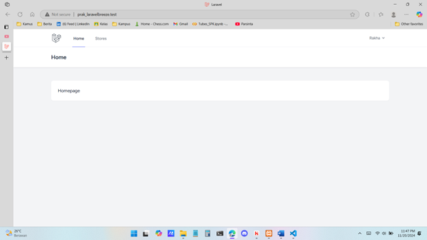
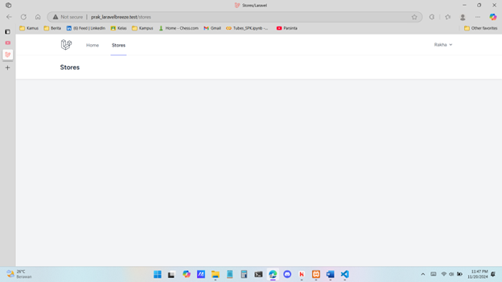
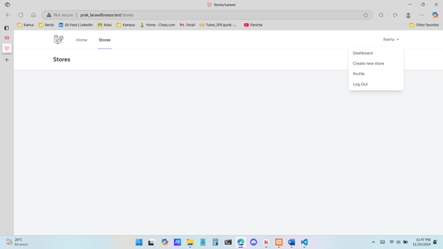
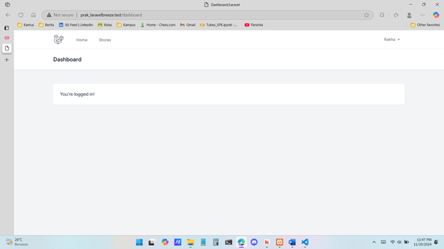
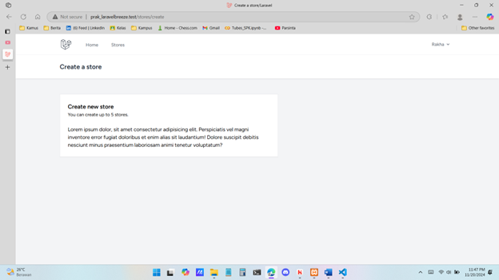
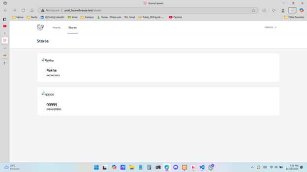
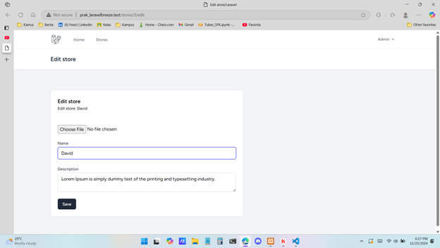

### Tugas 11

### Hasil Output

### Laravel 11/19 Table dan Komponen Card

### Laravel 11/20 FormRequest, Image dan Observer

### Laravel 11/21 Edit dan Refactoring

## Kontribusi

Dibuat oleh Firja Rakha Adwittya.

## Lisensi

Projek ini dilisensikan di bawah [MIT License](LICENSE).